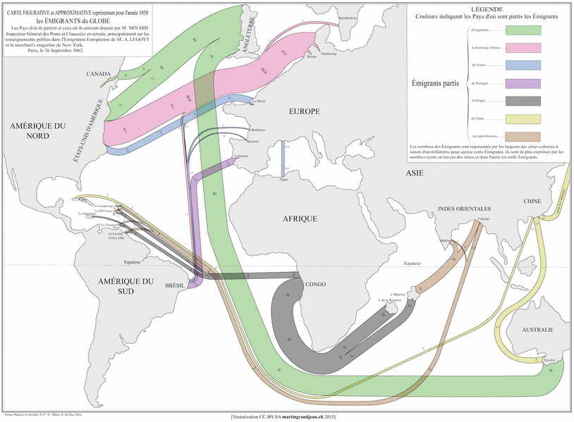

# Advanced filters with panflute

First we will add a figure:

~~~ figure 
title: Mapping *Migration* _Flows_ ~in~ 1862
source: 'minard.png'
label: 'migration'
innerwidth: 0.8
...
Write notes and sources here. Feel *free* to write a lot, use **markdown**, etc.

Charles Joseph Minard’s World Map/Sankey Diagram of Migration 1862; [CC-BY-SA Attribution](http://www.martingrandjean.ch/historical-data-visualization-mapping-migration-in-1862/).

UTF should also work: пустынных волн. Τη γλώσσα μου έδωσαν ελληνική. Done!
~~~


We can also add it with a fancier format:

```
~~~~~~~~~~~~~~~~~~~~~~~~~~~~~~~~~~ figure 
title: Mapping *Migration* _Flows_ ~in~ 1862
source: 'minard.png'
label: 'migration'
innerwidth: 0.8
...............................................................................
Write notes and sources here. Feel *free* to write a lot, use **markdown**, etc.

Charles Joseph Minard’s World Map/Sankey Diagram of Migration 1862; [CC-BY-SA Attribution](http://www.martingrandjean.ch/historical-data-visualization-mapping-migration-in-1862/).

UTF should also work: пустынных волн. Τη γλώσσα μου έδωσαν ελληνική. Done!
~~~~~~~~~~~~~~~~~~~~~~~~~~~~~~~~~~~~~~~~~~~~~~~~~~~~~~~~~~~~~~~~~~~~~~~~~~~~~~~
```


This is how it looks normally (i.e. with no captions):




~~~ table
alignment: LCR
caption: This is the **caption** # Markdown in caption requires pypandoc
header: true
source: table-advanced.csv
~~~


~~~ table
alignment: LCR
caption: This is the **caption**
header: true
---
Fruit, Quantity, Price  
apples, 15, 3.24  
oranges, 12, 2.22  
~~~


~~~ table
title: Credit Cards by Bank (August 2012)
notes: 'This table reports the number of credit cards (in thousands) and volume of credit card lending (in US dollars) per bank in August 2012, as well as the name of the retail chains belonging to the same conglomerate. *Other banks* comprise Banco Azteca, HSBC Bank, BIF, Mibanco and Banco de Comercio, each with less than \(1\%\) market share in terms of both cards and volume. Source: Superintendencia de Banca, Seguros y AFP.'
label: summary-banks
source: 'table-advanced.tex'
~~~

Lorem ipsum dolor sit amet, consectetur adipisicing elit, sed do eiusmod
tempor incididunt ut labore et dolore magna aliqua. Ut enim ad minim veniam,
quis nostrud exercitation ullamco laboris nisi ut aliquip ex ea commodo
consequat. Duis aute irure dolor in reprehenderit in voluptate velit esse
cillum dolore eu fugiat nulla pariatur. Excepteur sint occaecat cupidatat non
proident, sunt in culpa qui officia deserunt mollit anim id est laborum.


~~~ algorithms
title: K-Means
input: $\vx, \vy$
output: $\vz \in \SR$
steps:
  1. Something
  2. Something else
~~~

Lorem ipsum dolor sit amet, consectetur adipisicing elit, sed do eiusmod
tempor incididunt ut labore et dolore magna aliqua. Ut enim ad minim veniam,
quis nostrud exercitation ullamco laboris nisi ut aliquip ex ea commodo
consequat. Duis aute irure dolor in reprehenderit in voluptate velit esse
cillum dolore eu fugiat nulla pariatur. Excepteur sint occaecat cupidatat non
proident, sunt in culpa qui officia deserunt mollit anim id est laborum.

~~~ stata
title: A Stata Table
source: '../tmp/stuff.csv'
refresh: false
---
sysuse auto
collapse (mean) price, by(foreign)
outsheet using '../tmp/stuff.csv', replace
exit, STATA // implicit?
~~~


$backmatter